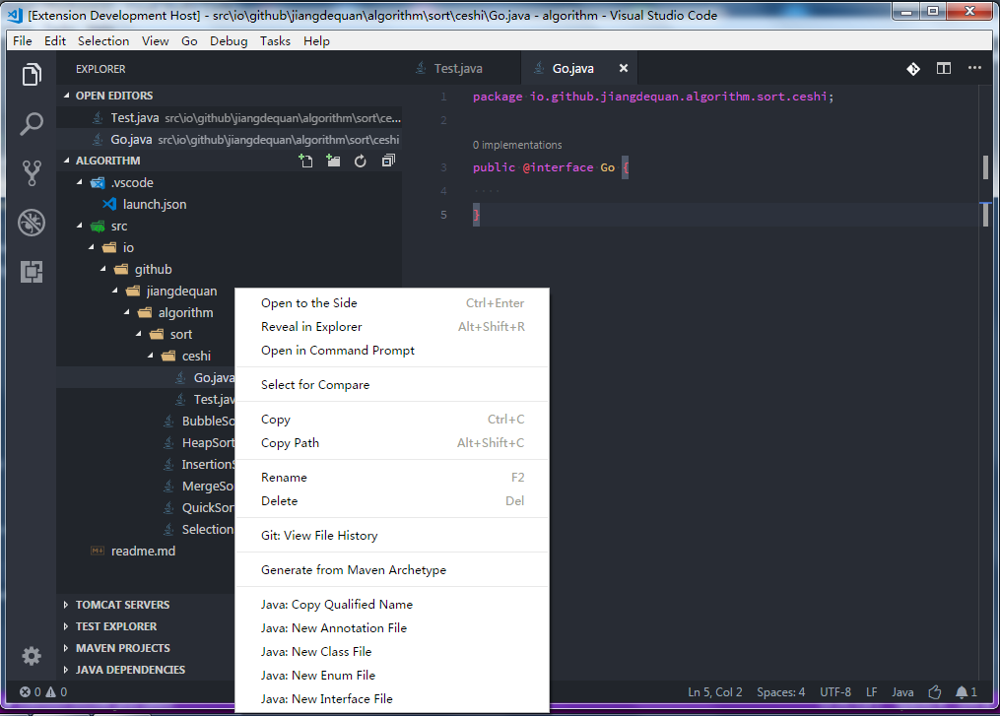
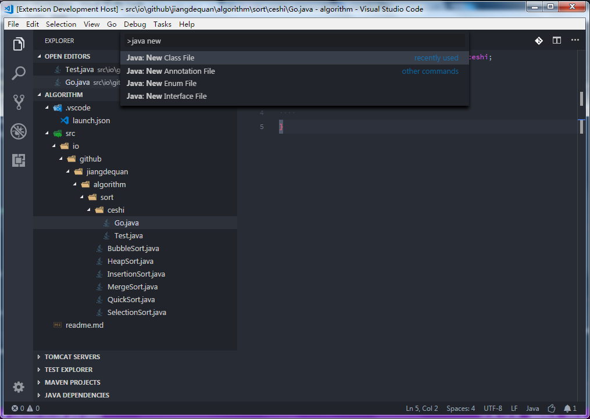
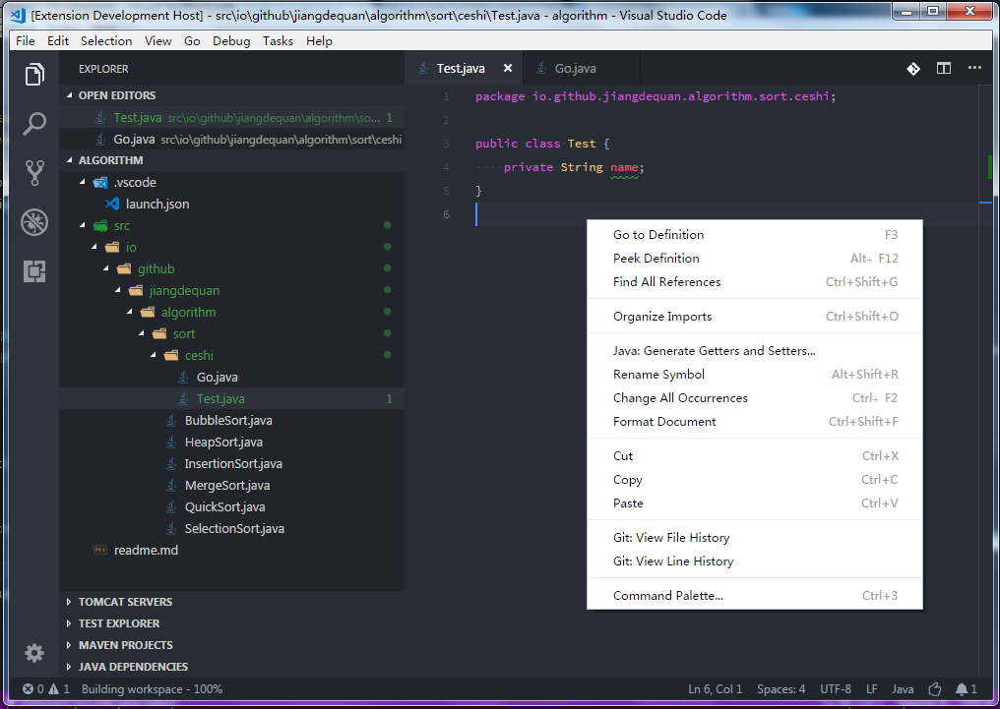
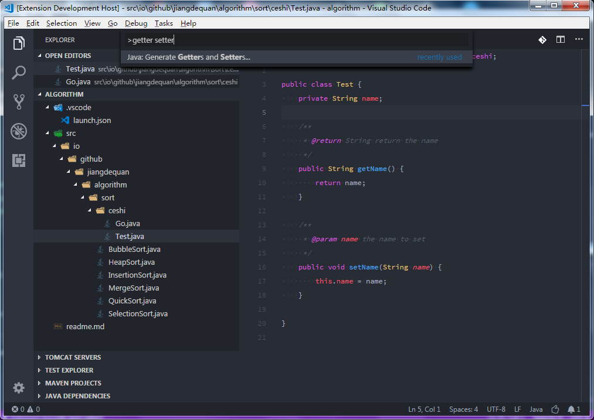
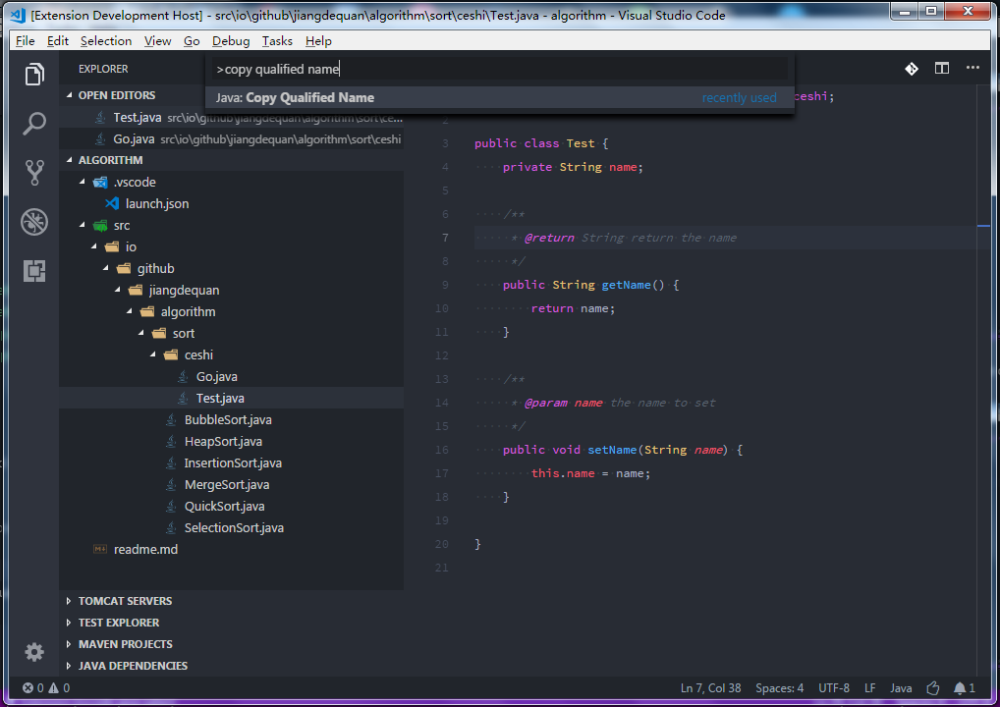

# Saber for VS Code | [中文](README_CN.md)
This extension includes many useful utilities for Java. 

# Overview
It makes users coding in java more efficient. Here`s a list of features:
* New Java files(annotation/class/interface/enum)
* Generate Getters and Getters
* Copy Qualified Name
* New Package

Some features ready to do:
* Sort Project By Name
* Rename Java File
* Generate Docs

# Requirements
* JDK (version 1.8.0 or later)
* VS Code (version 1.19.0 or later)

# Install
* clone this project
* copy the project to the directory of extension
* restart VS Code

# Use
PS: These functions are implemented by parsing strings in java files. Therefore, your codes should best meet the specification.
## New Java Files
1. right click a java file or a directory in the explorer

2. has a active text editor, ctrl + shift + p, type: java new

It will create a java file in the same directory of the opened file

## Generate Getters and Getters
1. right click the opened java file in the editor

2. has a active text editor, ctrl + shift + p, type: getter setter

## Copy Qualified Name
1. right click the opened java file in the explorer

2. has a active text editor, ctrl + shift + p, type: copy qualified name

# Feedback and Questions
You can find the full list of issues at [Issue Tracker](https://github.com/jiangdequan/vscode-java-saber/issues). You can submit a [bug or feature suggestion](https://github.com/jiangdequan/vscode-java-saber/issues/new).

# License
Dual-licensed under [BSD 2-Clause License](http://opensource.org/licenses/BSD-2-Clause) and [GPLv2 with the Classpath Exception](http://openjdk.java.net/legal/gplv2+ce.html).