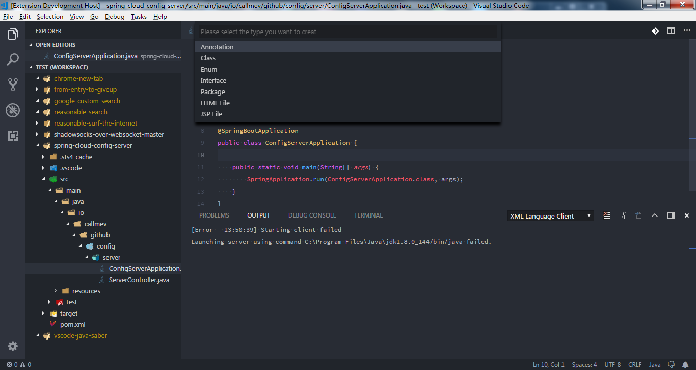

# Saber for VS Code | [中文](README_CN.md)
This extension includes many useful utilities for Java. To make the vscode work as Eclipse or IDEA when you are coding in java.

# Overview
It makes users coding in java more efficient. Here`s a list of features:
* New Java files(annotation/class/interface/enum)
* Generate Getters and Getters
* Copy Qualified Name
* New Package
* Sort Project By Name
* Run Maven Goals

Some features ready to do:
* Rename Java File
* Generate Docs

# Requirements
* JDK (version 1.8.0 or later)
* VS Code (version 1.19.0 or later)

# Install
* Install from the [Marketplace](https://marketplace.visualstudio.com/), you can find it by typing: "vscode-java-saber" "Java IDE"

Or:  

* Clone this project
* Copy the project to the directory of extension
* Restart VS Code

# Use
PS: These functions are implemented by parsing strings in java files. Therefore, your codes should best meet the specification of java.

## New Java Files
1. Right click a java file or a directory in the explorer

2. You must open a java file in text editor => ctrl + shift + p => type: java new

It will create a java file in the same directory of the opened file

## Generate Getters and Setters
1. Right click the opened java file in the editor

2. You must open a java file in text editor => ctrl + shift + p => type: getter setter

## Copy Qualified Name
1. Right click the opened java file in the explorer

2. You must open a java file in text editor => ctrl + shift + p => type: copy qualified name

## New Package
1. Right click a directory

## Sort Project By Name
1.Right click at the project explorer

2.edit the config "ide.projectAutoSort" to true, it will auto sort projects by name when adding a project to the workspace, default is false

3.ctrl + shift + p => type: Sort Project By Name

## Run Maven Goals
1. Right click a pom.xml

2.edit the config "ide.mavenDefaultGoals" to what you like, default is "clean install -Dmaven.test.skip=true" and "clean install"

# Feedback and Questions
You can find the full list of issues at [Issue Tracker](https://github.com/jiangdequan/vscode-java-saber/issues). You can submit a [bug or feature suggestion](https://github.com/jiangdequan/vscode-java-saber/issues/new).

# License
Dual-licensed under [BSD 2-Clause License](http://opensource.org/licenses/BSD-2-Clause) and [GPLv2 with the Classpath Exception](http://openjdk.java.net/legal/gplv2+ce.html).

This extention is included into ["Java IDE Pack" extention pack](https://github.com/paulvi/vscode-java-ide-pack/).
