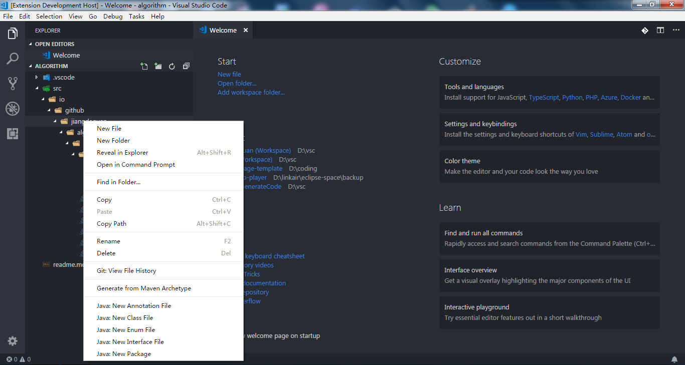
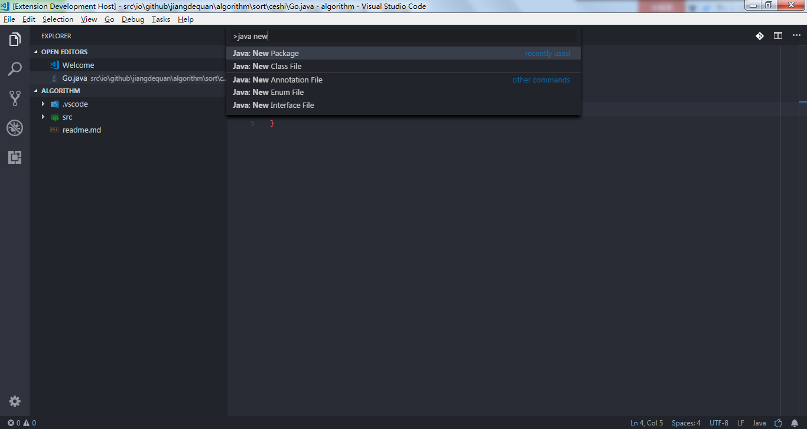
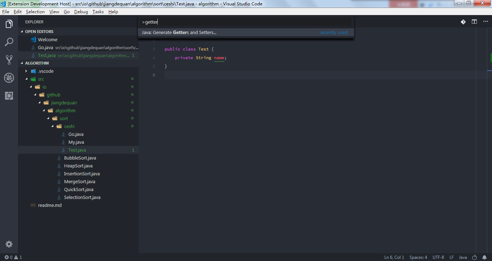
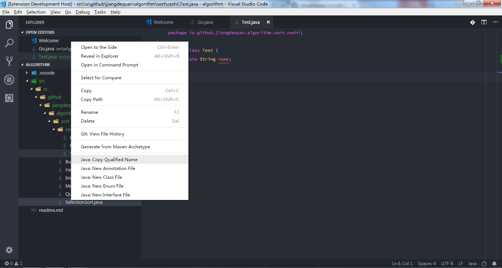
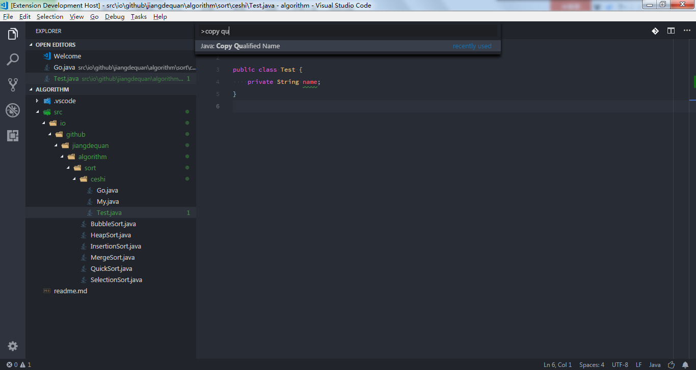

# Saber for VS Code简介 | [English](README.md)
此扩展包含了很多实用的Java开发工具, 尽可能提高开发效率. 使得VS Code像Eclipse和IDEA一样提供很多常用的开发功能.

# 功能特性
该插件包含的功能在一定程度可以提高开发的效率. 以下是该扩展支持的功能列表:
* 创建Java文件(注解/类/接口/枚举)
* 生成get和set方法
* 复制类路径
* 创建包
* 按工程名排序
* 执行Maven

其他准备加入的功能:
* 重命名Java文件
* 生成文档注释

# 环境准备
* JDK 1.8及以上
* VS Code 1.19及以上

# 安装
* 通过[扩展商城](https://marketplace.visualstudio.com/)进行安装, 输入: "vscode-java-saber" "Java IDE"进行查找

或:  

* 克隆该项目
* 拷贝该扩展到扩展目录
* 重启VS Code

# 使用
PS: 该扩展的大多数功能是通过解析字符串来实现的. 因此, 确保你的代码尽可能符合规范.

## 创建Java文件
1. 在左侧的项目列表浏览器中, 右键单击需要创建java文件位置(文件或者目录)

2. 当前编辑器中必须打开Java文件 => ctrl + shift + p => 输入: java new

则会在当前打开的编辑器文件的相同目录下创建Java文件.

## 生成get和set方法
1. 右键单击需要生成get和set方法的文件

2. 当前编辑器中必须打开Java文件 => ctrl + shift + p => 输入: getter setter

## 复制类路径
1. 在左侧的项目列表浏览器中, 右键单击需要复制类路径的Java文件

2. 当前编辑器中必须打开Java文件 => ctrl + shift + p => 输入: copy qualified name

## 新建包
1. 右键目录或者包

## 按工程名排序
1.右键左侧工程浏览框

2.编辑配置"ide.projectAutoSort"为true, 当添加项目的时候会自动排序, 默认为false

3.ctrl + shift + p => 输入: Sort Project By Name

## 执行Maven
1.在pom.xml右键

2.编辑配置"ide.mavenDefaultGoals"为常用的maven指令, 默认为"clean install -Dmaven.test.skip=true"和"clean install"

# 问题和反馈
在[Issue Tracker](https://github.com/jiangdequan/vscode-java-saber/issues)你可以看到所有的Issue.你也可以通过[bug or feature suggestion](https://github.com/jiangdequan/vscode-java-saber/issues/new)反馈问题和建议.

# 许可证
Dual-licensed under [BSD 2-Clause License](http://opensource.org/licenses/BSD-2-Clause) and [GPLv2 with the Classpath Exception](http://openjdk.java.net/legal/gplv2+ce.html).