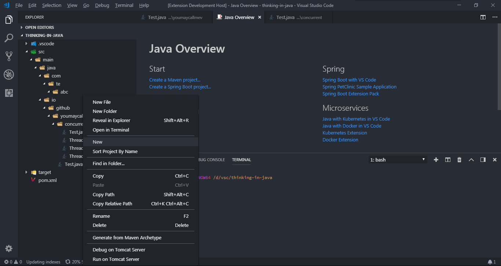
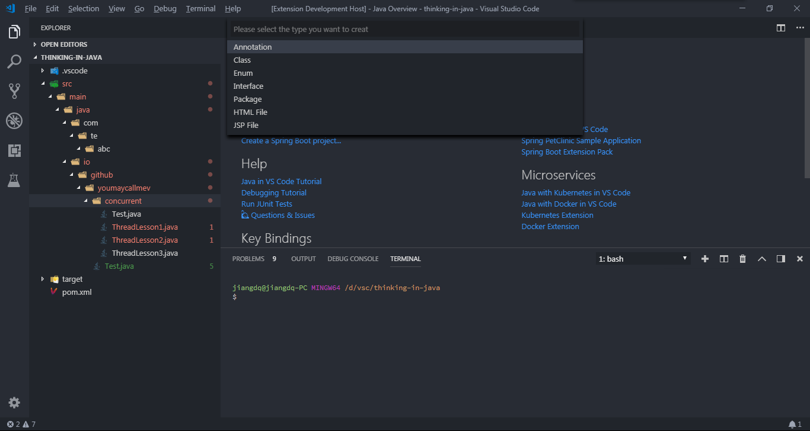
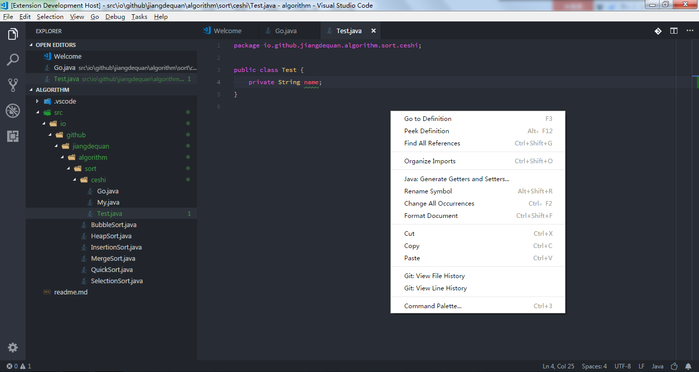
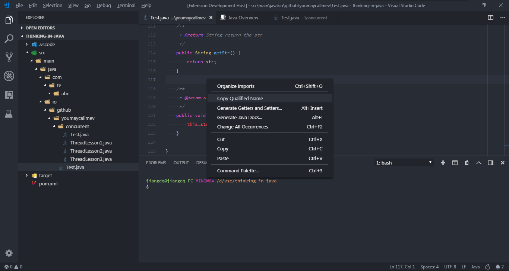
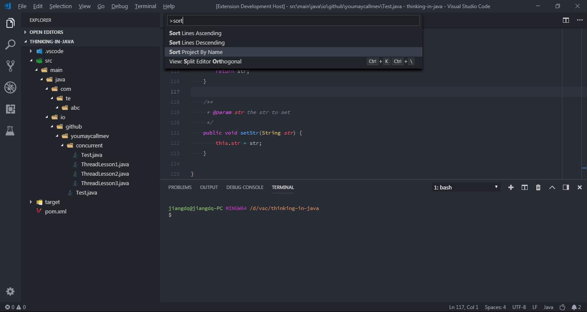
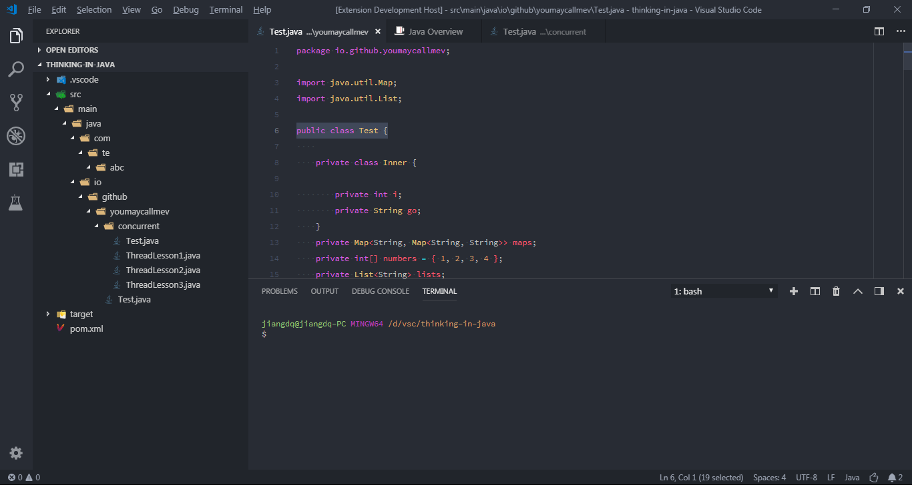
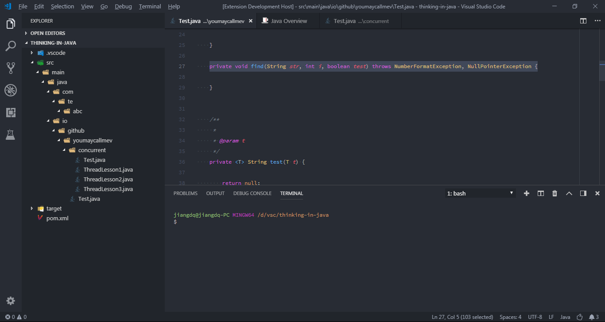
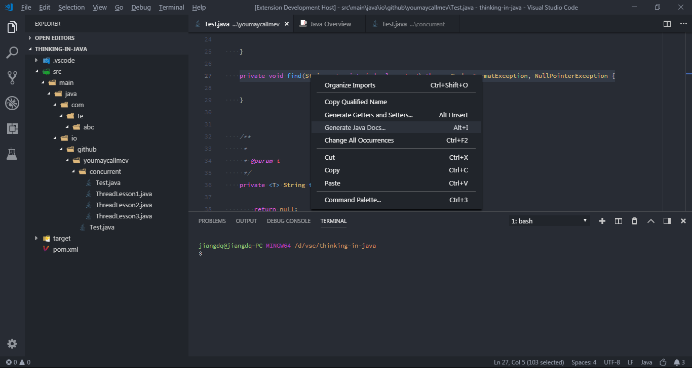

<h1 align="center">Saber for VS Code [<a href="README.md">English</a>]</h1>

    
    
    
    
    

此扩展包含了很多实用的Java开发工具, 尽可能提高开发效率. 使得VS Code像Eclipse和IDEA一样提供很多常用的开发功能.

# 功能特性
该插件包含的功能在一定程度可以提高开发的效率. 以下是该扩展支持的功能列表:
* 创建文件(注解/类/接口/枚举/包/JSP/HTML)
* 生成get和set方法
* 复制类路径
* 按工程名排序
* 执行Maven
* 生成文档注释

其他准备加入的功能:
* 重命名Java文件

# 环境准备
* JDK 1.8及以上
* VS Code 1.19及以上

# 安装
* 通过[扩展商城](https://marketplace.visualstudio.com/)进行安装, 输入: "vscode-java-saber" "Java IDE"进行查找

# 使用
PS: 该扩展的大多数功能是通过解析字符串来实现的. 因此, 确保你的代码尽可能符合规范.

## 创建文件
* __方法一__：在左侧的项目列表浏览器中, 右键单击需要创建java文件位置(文件或者目录)

* __方法二__：当前编辑器中必须打开Java文件 => ctrl + shift + p => 输入: java new

则会在当前打开的编辑器文件的相同目录下创建Java文件.

## 生成get和set方法
__已知问题：当类中定义了内部类时，生成getters/setters会出现问题__
* __方法一__：右键单击需要生成get和set方法的文件

* __方法二__：当前编辑器中必须打开Java文件 => ctrl + shift + p => 输入: getter setter

* __方法三__：使用快捷键 'alt + insert'

## 复制类路径
* __方法一__：在左侧的项目列表浏览器中, 右键单击需要复制类路径的Java文件

* __方法二__：当前编辑器中必须打开Java文件 => ctrl + shift + p => 输入: copy qualified name

* __方法三__：在打开的的类文件右击

## 按工程名排序
编辑配置"ide.projectAutoSort"为true, 当添加项目的时候会自动排序, 默认为false

* __方法一__：右键左侧工程浏览框

* __方法二__：ctrl + shift + p => 输入: Sort Project By Name

## 执行Maven
编辑配置"ide.mavenDefaultGoals"为常用的maven指令, 默认为"clean install -Dmaven.test.skip=true"和"clean install"

* __方法一__：在pom.xml右键

## 生成文档
* __方法一__: 
1. 选择需要生成文档的代码，如下图

2. 在类文件的编辑器中单击右键或者使用快捷键'alt + i'

# 问题和反馈
在[Issue Tracker](https://github.com/jiangdequan/vscode-java-saber/issues)你可以看到所有的Issue.你也可以通过[bug or feature suggestion](https://github.com/jiangdequan/vscode-java-saber/issues/new)反馈问题和建议.

# 许可证
Dual-licensed under [BSD 2-Clause License](http://opensource.org/licenses/BSD-2-Clause) and [GPLv2 with the Classpath Exception](http://openjdk.java.net/legal/gplv2+ce.html).